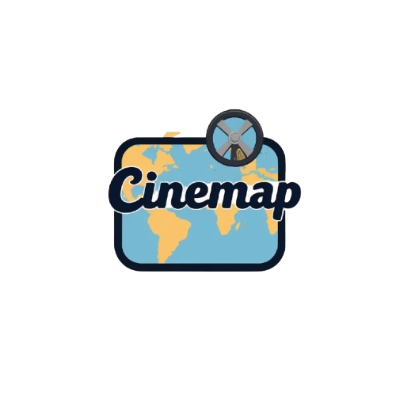

# 🎬 CineMap - Mapa de Ubicaciones Cinematográficas

<div align="center">
  
  <h1 style="display: inline-block; margin: 0; font-size: 2.5rem;">CineMap</h1>
  
  <p>Visualiza películas en su ubicación real de filmación</p>
  
  
  
  
  
  
</div>

## 📋 Índice
- [Descripción General](#-descripción-general)
- [Instalación y Configuración](#-instalación-y-configuración)
- [Especificaciones Técnicas](#-especificaciones-técnicas)
- [Arquitectura y Estructura](#-arquitectura-y-estructura)
- [APIs y Flujo de Datos](#-apis-y-flujo-de-datos)
- [Componentes y Funcionalidades](#-componentes-y-funcionalidades)
- [Uso y Ejemplos](#-uso-y-ejemplos)
- [Pruebas y Validación](#-pruebas-y-validación)
- [Mejoras Futuras](#-mejoras-futuras)

## 🎯 Descripción General

CineMap es una aplicación web interactiva que permite visualizar películas en un mapa mundial, mostrando sus ubicaciones reales de filmación. La aplicación integra múltiples APIs para proporcionar una experiencia enriquecedora al usuario, combinando datos cinematográficos con geolocalización.

### Objetivos Principales
- Visualizar películas en su contexto geográfico real
- Proporcionar información detallada sobre las producciones
- Ofrecer múltiples formas de descubrir películas
- Crear una experiencia de usuario intuitiva y atractiva

## 🚀 Instalación y Configuración

### Requisitos Previos
- Node.js y npm instalados
- Claves API para TMDB y OMDB

### Pasos de Instalación
```bash
# Clonar repositorio
git clone https://github.com/Rediaj04/cinemap.git
cd cinemap

# Instalar dependencias
npm install

# Configurar variables de entorno
cp .env.example .env
# Editar .env con tus claves API

# Iniciar desarrollo
npm start
```

### Configuración de Variables de Entorno
```env
REACT_APP_TMDB_API_KEY=tu_clave_tmdb
REACT_APP_OMDB_API_KEY=tu_clave_omdb
```

## 🛠 Especificaciones Técnicas

### Requisitos del Sistema
- Node.js (v14 o superior)
- npm (v6 o superior)
- Navegador web moderno con soporte para geolocalización

### Tecnologías Principales
- **Frontend**:
  - React 18.2.0
  - TypeScript
  - React-Leaflet 4.2.1
  - Leaflet 1.9.4
  - CSS Modules

### APIs Externas
- **TMDB API**: Información de películas
- **OMDB API**: Detalles adicionales
- **Nominatim**: Geocodificación de ubicaciones

### Dependencias Principales
```json
{
  "dependencies": {
    "react": "^18.2.0",
    "react-dom": "^18.2.0",
    "react-leaflet": "^4.2.1",
    "leaflet": "^1.9.4",
    "typescript": "^4.9.5"
  }
}
```

## 🏗 Arquitectura y Estructura

### Estructura del Proyecto
```
src/
├── api/                    # Lógica de integración con APIs
│   ├── movies.ts          # Funciones principales
│   ├── movieLocationsAPI.ts
│   ├── omdbAPI.ts
│   └── tmdbAPI.ts
├── components/            # Componentes React
│   ├── Map.tsx           # Componente principal del mapa
│   ├── MovieInfo.tsx     # Información de película
│   └── ...
├── config/               # Configuración
│   ├── api.ts           # Configuración de APIs
│   └── constants.ts     # Constantes globales
└── types.ts             # Definiciones de tipos TypeScript
```

### Patrones de Diseño
- **Componentes Funcionales**: Uso de React Hooks
- **Gestión de Estado**: useState y useEffect
- **Composición de Componentes**: Reutilización y modularidad
- **Manejo de Errores**: Try-catch y mensajes de error personalizados

## 🔌 APIs y Flujo de Datos

### Integración de APIs
1. **TMDB API**:
   ```typescript
   // config/api.ts
   export const API_CONFIG = {
     TMDB: {
       BASE_URL: "https://api.themoviedb.org/3",
       API_KEY: process.env.REACT_APP_TMDB_API_KEY,
       IMAGE_BASE_URL: "https://image.tmdb.org/t/p",
       DEFAULT_LANGUAGE: 'es-ES'
     }
   };
   ```

2. **OMDB API**:
   ```typescript
   export const API_CONFIG = {
     OMDB: {
       BASE_URL: "https://www.omdbapi.com",
       API_KEY: process.env.REACT_APP_OMDB_API_KEY
     }
   };
   ```

### Flujo de Datos
1. Usuario realiza una acción (búsqueda/película aleatoria)
2. Consulta a TMDB para datos básicos
3. Consulta a OMDB para país de filmación
4. Geocodificación del país
5. Renderizado en el mapa

## 🧩 Componentes y Funcionalidades

### Componente Map
```typescript
const Map: React.FC<MapProps> = ({ 
  locations, 
  selectedLocation,
  onLocationSelect 
}) => {
  return (
    <MapContainer center={[20, 0]} zoom={2}>
      <TileLayer
        url="https://{s}.tile.openstreetmap.org/{z}/{x}/{y}.png"
        attribution='&copy; OpenStreetMap'
      />
      {locations.map(location => (
        <Marker
          key={location.id}
          position={location.position}
          eventHandlers={{
            click: () => onLocationSelect(location)
          }}
        >
          <Popup>
            <MovieInfo movie={location} />
          </Popup>
        </Marker>
      ))}
    </MapContainer>
  );
};
```

### Funcionalidades Principales
1. **Búsqueda de Películas**:
   - Búsqueda por título
   - Filtrado de resultados
   - Visualización en mapa

2. **Película Aleatoria**:
   - Selección aleatoria de películas populares
   - Visualización de ubicación
   - Detalles completos

3. **Visualización en Mapa**:
   - Interactividad completa
   - Marcadores personalizados
   - Popups informativos

## 💻 Uso y Ejemplos

### Búsqueda de Películas
1. Ingresa el título en la barra de búsqueda
2. Los resultados se mostrarán en el mapa
3. Haz clic en un marcador para ver detalles

### Película Aleatoria
1. Haz clic en "Película Aleatoria"
2. El mapa se centrará en la ubicación
3. Se mostrarán los detalles completos

### Películas Cercanas
1. Permite el acceso a tu ubicación
2. Se mostrarán las películas más cercanas
3. Se indicará la distancia a cada ubicación

## 🧪 Pruebas y Validación

### Pruebas de Funcionalidad
- Validación de respuestas de API
- Manejo de errores de red
- Comportamiento de marcadores
- Interactividad del mapa

### Validación de Datos
- Verificación de coordenadas
- Validación de información de películas
- Comprobación de geocodificación

## 🔮 Mejoras Futuras

### Mejoras Técnicas
1. **Optimización de Rendimiento**:
   - Implementación de virtualización para grandes conjuntos de datos
   - Mejora del sistema de caché
   - Optimización de peticiones a API

2. **Nuevas Funcionalidades**:
   - Filtros avanzados por año, género, etc.
   - Rutas de filmación
   - Comparación de ubicaciones
   - Modo offline

3. **Mejoras de UX**:
   - Animaciones más fluidas
   - Temas personalizables
   - Modo oscuro/claro
   - Soporte para más idiomas

4. **Integración de APIs**:
   - Google Maps como alternativa
   - Wikipedia para información adicional
   - YouTube para tráilers
   - Redes sociales para compartir

### Consideraciones Técnicas
- Implementación de PWA
- Mejora de la accesibilidad
- Optimización para móviles
- Internacionalización completa

## 📝 Notas de Implementación

### Manejo de Errores
- Sistema de reintentos para peticiones fallidas
- Mensajes de error claros y descriptivos
- Fallbacks para datos faltantes

### Optimizaciones
- Caché de peticiones a API
- Lazy loading de imágenes
- Optimización de renderizado

### Seguridad
- Validación de datos de entrada
- Manejo seguro de claves API
- Protección contra XSS

## 📄 Licencia

Este proyecto está licenciado bajo la Licencia MIT - ver el archivo [LICENSE](LICENSE) para más detalles.

Copyright © 2025 CineMap
